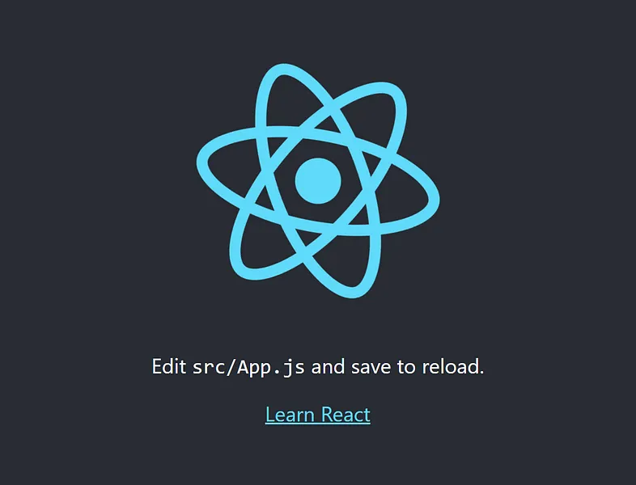
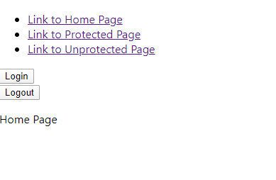

## ¿Por qué usamos Route Guards? (responde los beneficios tanto del lado del desarrollador como del cliente)


Siempre que desarrolle una aplicación React, será necesario restringir a los usuarios no autenticados el acceso a ciertas partes de su aplicación.
React Router es mi biblioteca de elección cuando se trata de enrutamiento para React, pero no hay una forma incorporada de proteger un < Route > del acceso sin restricciones. En este post te mostraré cómo construir fácilmente tus propias rutas vigiladas.

### Configuración de una aplicación de ejemplo

Primero ejecuta npx create-react-app route-guard en tu línea de comandos para arrancar una nueva React-Application.

La segunda ejecución npm comienza dentro de la carpeta route-guards recién creada para comprobar si todo funciona correctamente.

Como resultado, debería ver la página predeterminada create-react-app en su navegador:



### Configuración de algunas < Routes > para proteger

Ahora instalamos React Router ejecutando npm install react-router-dom, para configurar algunas rutas básicas que protegemos más adelante.

Además, configurar tres nuevos componentes React a los que podemos enrutar:

Home.js
```JavaScript
import React from 'react';

function Home(){
    return(
        <p>Home Page</p>
    );
}

export default Home;
```

Protected.js
```JavaScript
import React from 'react';

function Protected(){
    return(
        <p>Protected Page</p>
    );
}

export default Protected;
```

Unprotected.js
```JavaScript
import React from 'react';

function Unprotected(){
    return(
        <p>Unprotected Page</p>
    );
}

export default Unprotected;
```

Importe el BrowserRouter en su componente App.js y configure un < Router > con dos rutas.

Tus App.js deberían verse así:

App.js
```JavaScript
import React from 'react';
import {BrowserRouter as Router, Route, Switch} from 'react-router-dom';
import Protected from './Protected';
import Unprotected from './Unprotected';

function App() {
  return (
    
    <Router>
      <Switch>
        <Route path='/protected' component={Protected}/>
        <Route path='/unprotected' component={Unprotected}/>
      </Switch>
    </Router>

  );
}

export default App;
```

En un siguiente paso mostramos tres enlaces dentro del componente App.js para navegar fácilmente de una página a otra.

Importe Link desde react-router-dom y agregue las siguientes líneas a la parte superior del componente < Router > de su aplicación:

```HTML
<div>
   <ul>
       <li>
         <Link to='/'>
           Link to Home Page
         </Link>
       </li>
       <li>
         <Link to='/protected'>
           Link to Protected Page
         </Link>
       </li>
       <li>
         <Link to='/unprotected'>
           Link to Unprotected Page
         </Link>
       </li>
  </ul>
</div>
```

De este modo se completa la configuración básica, ahora podemos investigar la autenticación y cómo proteger una < Route >.

### Agregar autenticación falsa

Antes de que podamos agregar la protección de rutas, debemos agregar una autenticación falsa.

Debajo de la Navegación añadimos un botón Login y un Logout con un onClickhandler que apunta a las funciones correspondientes que definimos justo en la parte superior del componente.

Utilizamos useStatehook para guardar el estado de inicio de sesión de usuario actual dentro del estado del componente.

El componente App.js ahora debería verse así:

```JavaScript
import React, { useState } from 'react';
import { BrowserRouter as Router, Route, Switch, Link } from 'react-router-dom';
import Protected from './Protected';
import Unprotected from './Unprotected';
import Home from './Home';

function App() {
    const[isAutheticated, setisAutheticated] = useState(false);

  function login(){
    setisAutheticated(true);
    console.log("loggedInUser:" + isAutheticated)
  }

  function logout(){
    setisAutheticated(false);
    console.log("loggedInUser:" + isAutheticated)
  }
  
  return (
    <Router>
      <div>
        <ul>
          <li>
            <Link to='/'>
              Link to Home Page
          </Link>
          </li>
          <li>
            <Link to='/protected'>
              Link to Protected Page
          </Link>
          </li>
          <li>
            <Link to='/unprotected'>
              Link to Unprotected Page
          </Link>
          </li>
        </ul>
        <button onClick={login}>Login</button>
        <br/>
        <button onClick={logout}>Logout</button>
      </div>
      <Switch>
        <Route exact path='/' component={Home}/>
        <Route path='/protected' component={Protected} />
        <Route path='/unprotected' component={Unprotected} />
      </Switch>
    </Router>

  );
}

export default App;
```

### Ruta de protección al componente protegido

Ahora queremos proteger la página protegida del acceso sin restricciones de los usuarios.
Necesitamos escribir un GuardedRoute que envuelva un React-Router normal < Route >:

```JavaScript
import React from 'react';
import { Route, Redirect } from "react-router-dom";

const GuardedRoute = ({ component: Component, auth, ...rest }) => (
    <Route {...rest} render={(props) => (
        auth === true
            ? <Component {...props} />
            : <Redirect to='/' />
    )} />
)

export default GuardedRoute;
```

Ahora podemos usar el nuevo componente dentro del componente App.js.

```JavaScript
<GuardedRoute path='/protected' component={Protected} auth {isAutheticated} />
```

Permítanme explicar el código anterior:

En primer lugar creamos un nuevo componente envolviendo un React-Router < Route >. A continuación, cambiamos el nombre de la prop de componente a Componenteporque en JSX los nombres de etiqueta en minúsculas se consideran etiquetas HTML, por lo que los nombres de componente siempre deben empezar en mayúsculas. Dentro del render del componente < Router > comprobamos si el usuario está autenticado. Si es true, muestra el componente protegido. Si es false redirigimos a Home.js.

Ahora hemos terminado con la implementación. Reinicie la aplicación y pruebe las diferentes < Rutas >. No debería ser posible alcanzar el componente protegido si no está conectado. Si intenta llegar a la página protegida, la aplicación redirige a la página principal.



## Que es una solicitud POST?


El método HTTP POST envía datos al servidor. El tipo del cuerpo de la solicitud es indicada por la cabecera Content-Type.

La diferencia entre PUT y POST es que PUT es idempotente: llamarlo una o varias veces sucesivamente tiene el mismo efecto (no tiene efecto secundario // colateral), mientras que varios POST idénticos pueden tener efectos adicionales, como pasar una orden muchas veces.

Una solicitud POST es tipicamente enviada por un formulario HTML y resulta en un cambio en el servidor. En este caso, el tipo de contenido es seleccionado poniendo la cadena de texto adecuada en el atributo enctype del elemento < form > o el atributo formenctype de los elementos < input > o < button > :

- application/x-www-form-urlencoded: Los valores son codificados en tuplas llave-valor separadas por '&', con un '=' entre la llave y el valor. Caracteres no-Alfanumericos en ambas (llaves, valores) son percent encoded: Esta es la razón por la cual este tipo no es adecuado para usarse con datos binarios (use multipart/form-data en su lugar)
- multipart/form-data: Cada valor es enviado como un dato de bloque ("input de un formulario"), con un delimitador como separador definido por el usuario ("espacio entre campos"). Éstas llaves son colocadas en el Content-Disposition , la cual es cómo está estructurada cada parte del HEADER en una petición HTTP
- text/plain

Cuando la solicitud POST es enviada por otro método distinto a un formulario HTML — por ejemplo mediante una XMLHttpRequest — el cuerpo puede aceptar cualquier tipo. Como se describe en la especificación HTTP 1.1, el método POST está diseñado para permitir un método uniforme que cubra las siguientes funciones:

- Modificación de recursos existentes.
- Publicar un mensaje en un tablón de anuncios, grupo de noticias, lista de correos, o grupos similares de artículos;
- Agregar un nuevo usuario a través de un modal de suscripciones;
- Proveer un conjunto de datos, como resultado del envío de un formulario, a un proceso data-handling.
- Extender una base de datos a través de una operación de concatenación.

### Sintaxis

```HTTP
POST /index.html
```

### Ejemplo

Un formulario simple empleando el tipo de contenido por defecto application/x-www-form-urlencoded:

```HTTP
POST / HTTP/1.1
Host: foo.com
Content-Type: application/x-www-form-urlencoded
Content-Length: 13

say=Hi&to=Mom
```

Un formulario usando el tipo de contenido multipart/form-data:

```HTTP
POST /test.html HTTP/1.1
Host: example.org
Content-Type: multipart/form-data;boundary="boundary"

--boundary
Content-Disposition: form-data; name="field1"

value1
--boundary
Content-Disposition: form-data; name="field2"; filename="example.txt"

value2
```

## ¿Cuáles son algunas cosas que puede hacer para prepararse para las entrevistas de trabajo? (justifica tus respuestas, por ejemplo, si indico preparar información sobre la empresa, cómo lo hago...)


### Preparación para una entrevista en TI: qué preguntas se hacen, tareas y etapas


Una entrevista para una empresa de TI puede parecer un proceso desalentador y desalentador, especialmente para jóvenes profesionales y estudiantes. Pero si sabes qué preguntas se hacen, qué tareas se pueden ofrecer y qué etapas hay que pasar, aumentarás tus posibilidades de éxito. Veamos los principales tipos de entrevistas, preguntas típicas, tareas de ejemplo y brindemos consejos sobre cómo prepararse para una entrevista con una empresa de TI.


### Tipos de entrevistas


Existen diferentes tipos de entrevistas en las empresas. Cada uno tiene sus propias características y objetivos.


#### Entrevista técnica, entrevista de codificación.

Dirigido a poner a prueba habilidades y conocimientos profesionales. Se le puede pedir al solicitante que resuelva problemas de programación, responda preguntas sobre algoritmos y estructuras de datos y demuestre comprensión de tecnologías y herramientas específicas. Puede realizarse en formato de prueba en línea o en una plataforma de codificación especial. Es importante resolver el problema correctamente y explicar su enfoque y lógica. Esté preparado para hablar sobre los proyectos en los que ha trabajado.


#### Entrevista de habilidades blandas

En esta etapa se evalúan las habilidades comunicativas, la capacidad para trabajar en equipo, la capacidad para resolver conflictos y adaptarse a los cambios. Pueden preguntar sobre la experiencia trabajando en equipo, resolviendo situaciones difíciles.


#### Entrevista de recursos humanos

Realizado por un reclutador para evaluar la motivación, los objetivos profesionales y la alineación con los valores corporativos de la empresa. Puede haber preguntas sobre las expectativas del trabajo, las razones para cambiar de trabajos anteriores y los planes. Es importante mostrar interés en la empresa y explicar por qué quieres trabajar aquí.


#### Entrevista con el gerente

Reunión con un posible supervisor o director de proyecto. Evalúan qué tan adecuado es un candidato para un equipo o proyecto específico.


#### Entrevista grupal

Implica la participación de varios candidatos simultáneamente. Esto puede ser una discusión de casos o la realización de tareas conjuntas. El empleador evalúa la capacidad para trabajar en equipo, la capacidad de liderazgo y la capacidad de encontrar un lenguaje común con otros participantes.


#### Entrevista final

Generalmente se lleva a cabo con la persona que toma la decisión de contratación. Se discuten los resultados de las etapas anteriores, expectativas en cuanto a salario y condiciones laborales. Es importante estar preparado para discutir los detalles de la oferta y mostrar su disposición para comenzar a trabajar.


### Etapas de las entrevistas en empresas de TI.


El proceso de entrevista en las empresas de TI suele constar de varias etapas. Cada etapa puede incluir uno o más tipos de entrevistas, que describimos anteriormente.


1. Entrevista de selección con un especialista en RRHH.

En la primera etapa, se verifica que el currículum cumpla con los requisitos del puesto y se evalúan las habilidades interpersonales. RR.HH. puede preguntarle sobre su experiencia laboral, motivación, expectativas salariales y motivos para buscar un nuevo trabajo. Es importante mostrar interés.


2. Entrevista técnica.

En esta etapa, se ponen a prueba sus habilidades y conocimientos profesionales. Puede constar de varias partes. Se ofrecerán a resolver problemas de programación o realizar una revisión del código y preguntarán sobre algoritmos y estructuras de datos. Las entrevistas técnicas suelen ser realizadas por desarrolladores experimentados o líderes de equipo. Evalúan la capacidad de un candidato para resolver problemas de la vida real.


3. Entrevista con el gerente

La etapa final es una entrevista con el director o alto directivo de la empresa. Aquí evalúan si eres apto para trabajar en equipo y si compartes los valores de la empresa. El gerente puede estar interesado en los objetivos profesionales y las expectativas laborales. Es importante mostrar su disposición a cooperar a largo plazo y su deseo de contribuir al desarrollo de la empresa.


Mencionemos especialmente la entrevista de estrés. Algunas empresas pueden utilizar este método para probar la resistencia al estrés y la capacidad para resolver problemas no estándar. Durante una entrevista de estrés, pueden hacer preguntas inesperadas o provocativas, u ofrecerse a resolver una tarea por un tiempo. Es importante mantener la calma y mostrar capacidad para manejar la presión. O rechace este formato si no le conviene.

### Preguntas populares de la entrevista


#### Preguntas sobre experiencia y habilidades.

El reclutador puede preguntar:

- Cuéntanos cuál es el proyecto más interesante que has realizado.
- ¿Qué lenguajes y frameworks de programación hablas?
- Da un ejemplo de un problema difícil que pudiste resolver.

Aquí es importante no sólo enumerar las tecnologías utilizadas, sino también mostrar su papel en los proyectos, resaltar sus fortalezas y logros. Explica cómo resolviste el problema y qué aprendiste.


#### Preguntas teorias

Las preguntas técnicas ponen a prueba tus conocimientos. Mucho depende de la especialización específica, pero algunos temas son relevantes para casi todos:

- ¿Qué es OOP, SÓLIDO, BESO, SECO?
- ¿Qué tipos de pruebas conoces? ¿Cuál es la diferencia entre pruebas unitarias y de integración?
- ¿Qué es la inyección SQL y cómo prevenirla?
- Explique la diferencia entre proceso y hilo.

Incluso si no sabes la respuesta exacta, no te pierdas. Intenta pensar en voz alta, recuerda conceptos similares. Es importante que el empleador vea su línea de pensamiento.


#### Preguntas y tareas del caso

Casi siempre se ofrecen tareas prácticas en las entrevistas.

Por ejemplo:

- ¿Cómo invertir una cadena?
- Escribe una función para encontrar elementos únicos en una matriz.
- Diseñar una base de datos para una tienda online.
- ¿Cómo implementaría la búsqueda en el sitio?

No te quedes callado. Exprese sus ideas, haga preguntas aclaratorias. Incluso si no escribe un código perfecto, el reclutador apreciará su capacidad para analizar un problema y encontrar soluciones.


#### Preguntas sobre habilidades blandas

Las cualidades personales y la capacidad de trabajar en equipo en el campo de las tecnologías de la información no son menos importantes que las habilidades técnicas. Esté preparado para responder las siguientes preguntas:

- ¿Cómo lidias con el estrés y los plazos?
- ¿Alguna vez ha tenido un conflicto con un colega y cómo lo resolvió?
- ¿Qué haces si no estás de acuerdo con la decisión de tu jefe?
- ¿Cómo afrontas las críticas a tu código?

Da ejemplos reales de tu experiencia. Demuestre que puede resolver problemas de manera constructiva, que está abierto a recibir comentarios y que está dispuesto a trabajar en equipo.


### Ejemplos de tareas para un especialista en TI


La entrevista puede incluir tareas para evaluar las habilidades técnicas y el enfoque para la resolución de problemas. A continuación se muestran algunos ejemplos.


#### Problemas algorítmicos

Ponen a prueba su capacidad para trabajar con datos y crear algoritmos eficaces.

Ejemplos típicos:

Encontrar elementos únicos en una matriz: escriba una función que tome una matriz de números y devuelva una matriz de elementos únicos.

Cadena inversa: escribe una función que toma una cadena y la devuelve en orden inverso.

Escribe una función que tome dos números y devuelva su máximo común divisor.


#### Tareas de diseño

Ponen a prueba la capacidad de estructurar datos y diseñar arquitectura de aplicaciones.

Por ejemplo, diseñe una base de datos para una tienda en línea.


#### Tareas de optimización

Pruebe su capacidad para mejorar el rendimiento del código y los sistemas.

Por ejemplo, optimice el procesamiento de imágenes paralelizándolo en varios subprocesos.


#### Tareas de prueba

Ponen a prueba la capacidad de escribir pruebas y garantizar la calidad del código. Por ejemplo, escribe pruebas unitarias para una función que calcula el factorial de un número.


Es importante no sólo saber resolver, sino también poder explicar su enfoque y la lógica de la solución.


### Preguntas para el empleador


Una entrevista es una oportunidad para aprender más sobre un posible empleador. Vale la pena tomarse el tiempo para preparar sus preguntas; obtendrá información que lo ayudará a tomar una decisión informada.


Ejemplos de preguntas para hacer durante una entrevista:


#### Sobre el proyecto y las tareas.

¿En qué proyecto trabajaré? ¿Qué desafíos enfrenta el equipo?

¿Quién me asignará tareas y evaluará mi trabajo? ¿Con qué frecuencia se reúne con su gerente?

¿Cómo se organiza el proceso de desarrollo y prueba?


#### Sobre el equipo y los compañeros

¿Cuántas personas hay en el equipo del proyecto? ¿Cuáles son sus roles y niveles de experiencia?

¿Cómo es común interactuar y compartir conocimientos?

¿Se practica la tutoría?


#### Sobre la cultura y los valores corporativos

¿Cómo describiría la cultura corporativa de la empresa?

¿Se fomenta la iniciativa y el aporte de ideas y soluciones?

¿Cuáles son los planes de la empresa? ¿Cuáles son tus objetivos para el próximo año?


#### Acerca de las oportunidades de desarrollo

¿Qué oportunidades existen de desarrollo profesional y formación en la empresa?

¿La empresa admite hablar en conferencias, escribir artículos y participar en proyectos de código abierto?

¿Con qué frecuencia y con qué criterios se revisan los salarios de los empleados?


#### Sobre el proceso de empleo

¿Cuáles son los próximos pasos de selección después de esta entrevista?

¿Cuál es su fecha límite para cubrir esta vacante? ¿Cuándo debo esperar comentarios?

Si me aprueban para este puesto, ¿cuándo espero comenzar a trabajar?


Seleccione entre 5 y 7 preguntas que sean más importantes para usted e intente integrarlas discretamente en el diálogo. Al hacer preguntas, demostrará que está realmente interesado en la empresa y el puesto, demostrando habilidades de comunicación, curiosidad y capacidad analítica.


### Cómo prepararse para una entrevista en una empresa de TI


La preparación se puede dividir en varios pasos.

1. Infórmese sobre la empresa.

Qué hace, qué productos o servicios ofrece, quién es su público objetivo. Esto le ayudará a comprender mejor qué tareas deben resolverse y cómo las habilidades pueden resultar útiles para la empresa. Lea las reseñas de los empleados.


2. Prepare respuestas a preguntas típicas que se suelen hacer durante las entrevistas.

Una breve historia sobre tu experiencia, habilidades y logros.

Una explicación de qué te atrae de la empresa y cómo puedes ayudar.

Haga una lista de fortalezas y debilidades.

Prepara una historia sobre un problema difícil que lograste resolver. Utilice la técnica STAR (situación, tarea, acción, resultado) para estructurar su respuesta.

O una técnica PARLA similar:

Problem - problema, complejidad;

Action: acciones tomadas;

Result - resultado;

Learned - lección, conclusiones;

Applied: cómo se aplicó posteriormente la experiencia.


3. Practica la resolución de problemas técnicos.

Las plataformas LeetCode, HackerRank y CodeSignal ofrecen tareas de distintos niveles de dificultad.

Escribe código en un editor de texto sin autocompletado para acostumbrarte a las condiciones de una entrevista real.


4. Prepare preguntas para el empleador.

Haga preguntas para obtener más información sobre la empresa y su función dentro de ella.


5. Practica la entrevista.

Realice una entrevista grabada con un amigo o colega. Escuche o mire la grabación.

Esto ayudará a identificar puntos débiles y mejorar las respuestas. Preste atención al lenguaje corporal, las expresiones faciales, los gestos.

Pruebe los servicios web:

- Interview Warmup es un simulador de Google basado en inteligencia artificial, donde puedes practicar respondiendo preguntas populares de reclutadores en diversas áreas de TI (análisis de datos, comercio electrónico, soporte de TI, etc.). El servicio analiza las respuestas y hace recomendaciones.
- Pramp: los participantes se turnan para entrevistarse entre sí utilizando un editor de código común y comunicación de audio y video. Las primeras 6 entrevistas son gratuitas.
- Interviewing.io es un sitio para practicar entrevistas anónimas con ingenieros experimentados de las principales empresas de TI. El idioma principal es el inglés.

6. Prepárese para la entrevista en línea.

Comprueba con antelación que todo funciona: Internet, cámara, micrófono.

Elija un fondo neutro.

Vístete apropiadamente.